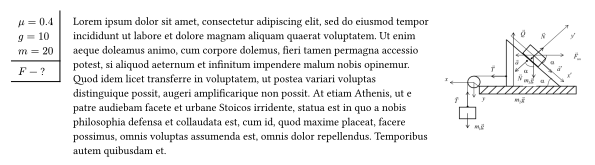
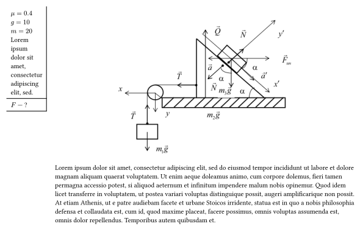

# Installation
The easiest method is to import `solving-physics: task` from the `@preview` package:
```typ
#import "@preview/solving-physics:0.1.0": *
```

# Usage
```typ
#task(
  given: [
    $mu = 0.4$ \
    $g = 10$ \
    $m = 20$
  ],
  find: [
    $F$ --- ?
  ],
  fig: image("./example.png", width: 5cm)
)[
  #lorem(100)
]
```


# Stroke
```typ
#task(
  given: [
    $mu = 0.4$ \
    $g = 10$ \
    $m = 20$
  ],
  find: [
    $F$ --- ?
  ],
  stroke: "full"
)[]
```


```typ
#task(
  given: [
    $mu = 0.4$ \
    $g = 10$ \
    $m = 20$
  ],
  find: [
    $F$ --- ?
  ],
  stroke: "find"
)[]
```


```typ
#task(
  given: [
    $mu = 0.4$ \
    $g = 10$ \
    $m = 20$
  ],
  find: [
    $F$ --- ?
  ],
  stroke: none
)[]
```


# Given width
If you have so large given you may use `given-width`:
```typ
#task(
  given: [
    $mu = 0.4$ \
    $g = 10$ \
    $m = 20$ \
    #lorem(10)
  ],
  given-width: 6em,
  find: [
    $F$ --- ?
  ],
)[]
```


# Figure align
You may locate you figure on the center of body by `fig-align: top + center`
```typ
#task(
  given: [
    $mu = 0.4$ \
    $g = 10$ \
    $m = 20$
  ],
  find: [
    $F$ --- ?
  ],
  fig: image("./example.png", width: 60%),
  fig-align: top + center
)[
  #lorem(100)
]
```
